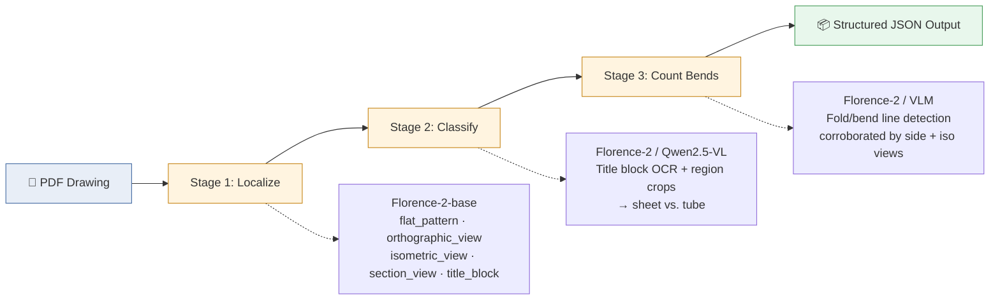

# VLM Pipeline — Manufacturing-Drawing Part Classification

A three-stage Vision Language Model (VLM) pipeline that ingests single-part engineering PDF drawings and extracts structural parameters: visual region localization, part classification (`sheet` vs. `tube`), and sheet-metal bend counting.

Developed for **AAI Labs (2026)**.

---

## Pipeline Architecture

The processing pipeline runs sequentially across three vision-language stages:



| Stage | Name | Model | Purpose | Status |
| :--- | :--- | :--- | :--- | :--- |
| **Stage 1** | **Localize** | Florence-2-base | Grounding model locates `flat_pattern`, `orthographic_view`, `isometric_view`, `section_view`, and `title_block` regions with bounding boxes. | ✅ Completed |
| **Stage 2** | **Classify** | Florence-2 / Qwen2.5-VL | Extracts title block text and region crops to classify part type (`sheet` vs. `tube`). | ✅ Completed |
| **Stage 3** | **Count Bends** | Florence-2 / VLM | Detects fold/bend lines in flat pattern views corroborated by side and isometric projections. | ✅ Completed |

---

## Ground Truth (Reference Set)

The baseline reference dataset consists of standardized engineering drawings and synthetic benchmark samples:

| Drawing ID | Part Class | Bends | Key Discriminating Signal |
| :--- | :--- | :---: | :--- |
| `001_BRACKET` | `sheet` | 2 | `Abwicklung` present; U-channel side profile indicates 2 folds |
| `002_PLATE` | `sheet` | 0 | Flat plate profile; corner chamfers (2×45°) are cut features, not bends |
| `003_SQUARE_TUBE` | `tube` | N/A | Closed hollow square section (`ROHR 80X80`) + linear extrude length |
| `004_ADAPTER_PLATE` | `sheet` | 0 | Flat bar stock; stepped edge profiles represent milling/laser cuts |

---

## Repository Structure

```
vlm-drawing-pipeline/
├── src/
│   ├── localize.py            # Stage 1: Bounding box region detection
│   ├── classify.py            # Stage 2: OCR & part type classification
│   ├── count_bends.py         # Stage 3: Bend line detection & counting
│   ├── pipeline.py            # Master orchestrator for end-to-end run
│   └── visualize.py           # Streamlit visualizer dashboard
├── configs/
│   └── model_config.yaml      # Hyperparameters, confidence thresholds, hardware execution targets
├── prompts/
│   ├── stage1_grounding.txt   # Task prompts for visual grounding
│   ├── stage2_ocr.txt         # Title block extraction prompts
│   └── stage3_bends.txt       # Bend detection corroboration prompts
├── reference_samples/         # PDF drawings (gitignored — keep files local)
├── output/                    # Generated prediction JSONs and visualization artifacts
│   ├── *_regions.json         # Stage 1 localized bounding boxes
│   ├── *_classification.json  # Stage 2 part classifications
│   └── *_bends.json           # Stage 3 bend counts
├── docs/
│   └── model_rationale.md     # Latency, accuracy, and cost comparisons
├── generate_all_samples.py    # Synthetic CAD drawing generator script
├── run_batch.sh                # Shell script for batch running all reference drawings
├── requirements.txt            # Project dependencies
├── .env               # API keys and environment variables template
└── README.md
```

---

## Setup & Installation

### Prerequisites
- Python 3.10+
- CUDA-capable GPU (recommended for local VLM inference with PyTorch)

### Environment Configuration

```bash
# Clone repository
git clone https://github.com/aai-labs/vlm-drawing-pipeline.git
cd vlm-drawing-pipeline

# Initialize virtual environment
python3 -m venv .venv
source .venv/bin/activate    # On Windows: .venv\Scripts\activate

# Install dependencies
pip install -r requirements.txt

# Setup environment variables
cp .env.example .env
```

---

## Execution Guide

### 1. Generate Test Synthetic Drawings

If testing without local PDF drawings, generate standard sample PDFs using matplotlib:

```bash
python3 generate_all_samples.py
```

### 2. Run Pipeline Stages

Run batch processing on all PDFs in `reference_samples/`:

```bash
./run_batch.sh
```

Run individual stages manually:

```bash
# Stage 1: Region Localization
python3 src/localize.py --input reference_samples/001_sample_bracket.pdf --out output/

# Stage 2: Part Classification
python3 src/classify.py --input output/001_sample_bracket_regions.json --out output/

# Stage 3: Bend Counting
python3 src/count_bends.py --input output/001_sample_bracket_classification.json --out output/
```

### 3. Visual Dashboard & Output Verification

Inspect visual bounding box overlays and extraction predictions side-by-side:

```bash
./script/visualize.py
```

---

## Output Data Formats

Each stage produces structured JSON outputs in the `output/` folder.

**Bounding Boxes** — `output/001_sample_bracket_regions.json`

```json
{
  "drawing_id": "001_sample_bracket",
  "regions": [
    {
      "type": "flat_pattern",
      "bbox": [1262, 523, 2279, 1264],
      "conf": 0.92
    },
    {
      "type": "title_block",
      "bbox": [1262, 446, 1904, 493],
      "conf": 0.92
    }
  ]
}
```

**Classification Output** — `output/001_sample_bracket_classification.json`

```json
{
  "drawing_id": "001_sample_bracket",
  "part_class": "sheet",
  "confidence": 0.96,
  "signals": {
    "title_block_process": "ABWICKLUNG",
    "material": "1.4301",
    "thickness_mm": 2.0
  }
}
```

**Bend Count Output** — `output/001_sample_bracket_bends.json`

```json
{
  "drawing_id": "001_sample_bracket",
  "bend_count": 2,
  "bend_lines": [
    {"type": "up", "position_x": 165},
    {"type": "down", "position_x": 215}
  ]
}
```

---

## Model Benchmark & Rationale

Detailed hardware, latency, and accuracy comparisons are available in `docs/model_rationale.md`.

| Approach | Model(s) | Cost | Latency | Notes |
| :--- | :--- | :--- | :--- | :--- |
| **Local** | `microsoft/Florence-2-base` | Zero API cost | ~240 ms / page (RTX 3090, CUDA) | Low VRAM footprint (~1.2 GB) |
| **Hybrid** | `Qwen2.5-VL-7B` / `GPT-4o` | API cost | Higher | Auxiliary fallback for ambiguous German CAD abbreviations (`Abwicklung`, `Rohr`, `Blech`) in complex multi-page title blocks |

---

## Reproducibility

All pipeline runs use deterministic inference settings (`temperature=0.0`, fixed random seed `42`) to guarantee identical bounding box predictions and text extractions across executions.
